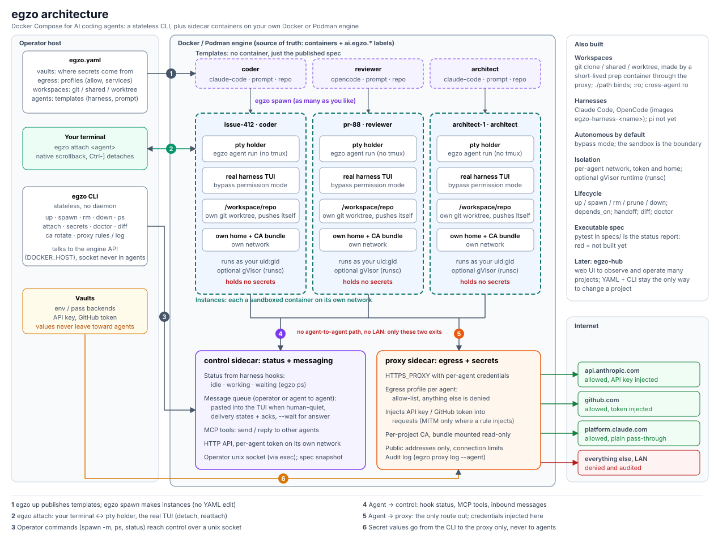

# Introduction

Egzo is Docker Compose for AI coding agents. You describe agents as **templates** in one `egzo.yaml`, start as many
**instances** as you need, each in its own sandbox, and attach to any of them with the real TUI of the harness
(Claude Code, OpenCode). Egzo does not re-render anything: detach, reattach, scrollback and keys behave as usual.

Three ideas carry the design:

- **The sandbox is the security boundary.** Agents run in their harness's bypass mode and never stop to ask
  permission. What limits the damage is where they run: a container of their own, on a network with no route out except
  through the egzo proxy, running as your uid, optionally under gVisor.
- **Secrets never reach the agent.** Credentials live in the proxy, which adds them to outgoing requests for the
  hosts you named. A compromised agent cannot leak credentials it does not have. It can still use them through the
  proxy while it runs, for those hosts; [the security model](security.md) spells out what that means.
- **No daemon.** The `egzo` CLI is stateless. Everything else is containers on your own Docker or Podman, and the
  engine is the source of truth.

## How it fits together



In short:

```
 egzo CLI ──(Docker/Podman API)──▶ engine
                                    ├─ proxy     injects credentials, allowlists egress, audits
                                    ├─ control   agent status, message queue, MCP tools
                                    └─ agents    one container each, own network, own workspace
```

- `egzo up` starts the **proxy** and the **control** sidecar and publishes the templates. It starts no agent.
- `egzo spawn <template>` makes an **instance**: a container, its own network, home volume and git checkouts.
- An agent can reach only the proxy and the control sidecar, never another agent and never your network.
- Messages and status flow through harness hooks and a small MCP tool set (`egzo` tools such as `resolve`, `ask`),
  not through screen scraping.

## Requirements

Linux with Docker or Podman (see [Installing](install.md)), reached through `DOCKER_HOST` like the docker CLI does (default
`/var/run/docker.sock`). For rootless Podman:

```console
$ systemctl --user enable --now podman.socket
$ export DOCKER_HOST=unix://$XDG_RUNTIME_DIR/podman/podman.sock
```

gVisor: register `runsc` with Docker and set `runtime: runsc` on an agent. Podman's API cannot select a runtime, so
egzo refuses to start such an agent there. Docker is the engine the specs run against today.

Run `egzo doctor` to check the engine and its isolation. [Installing](install.md) has the details, and
[the security model](security.md) says what the isolation does and does not give you.

## A first run

```console
$ egzo init --harness claude-code     # scaffolds egzo.yaml
$ export ANTHROPIC_API_KEY=...
$ egzo up
$ egzo spawn claude --attach          # the real Claude Code, in a sandbox
```

Detach with `Ctrl-]`; `egzo attach <name>` comes back. `egzo init` fills the repository URL from your git `origin`;
check the generated file before `up` (it leaves `TODO` comments where it had to guess). Next: [the project
file](project-file.md), then [managing projects](managing-projects.md) and [sandboxing agents](sandboxing.md). If
something misbehaves, see [troubleshooting](troubleshooting.md).

## Status

Working on Docker: validation, `up` / `spawn` / `rm` / `down`, templates and instances, the egress proxy with
credential injection, git workspaces, Claude Code and OpenCode, message delivery, and the operator commands. Not yet:
the `pi` harness, and the Podman and gVisor spec runs. A separate hub and web UI is planned ([`roadmap/`](../roadmap/hub-and-web-ui.md)), not part
of the CLI. Published images and a release are still to come ([`roadmap/initial-release.md`](../roadmap/initial-release.md)).
